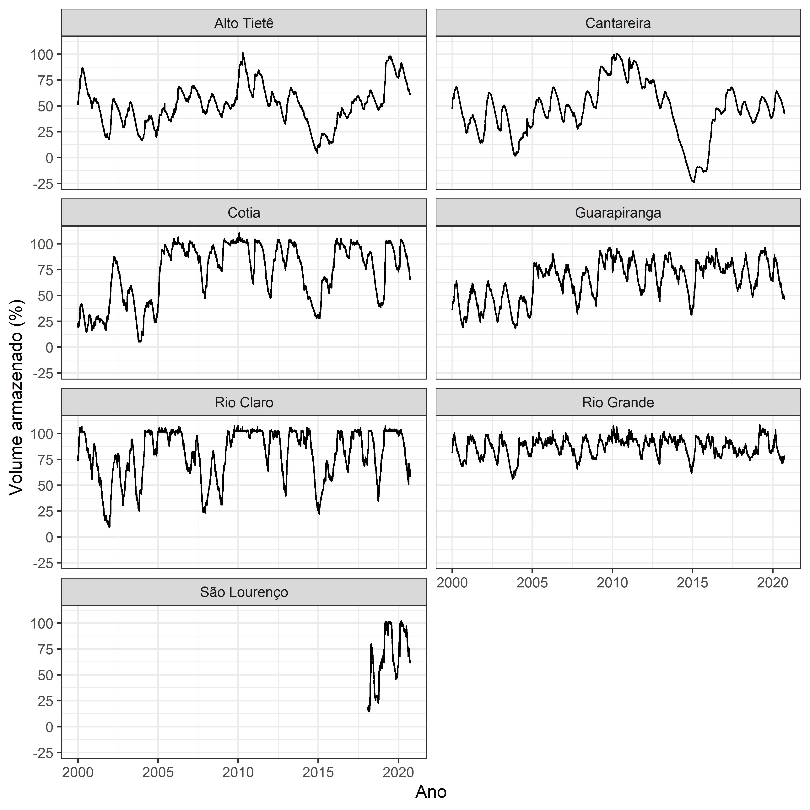
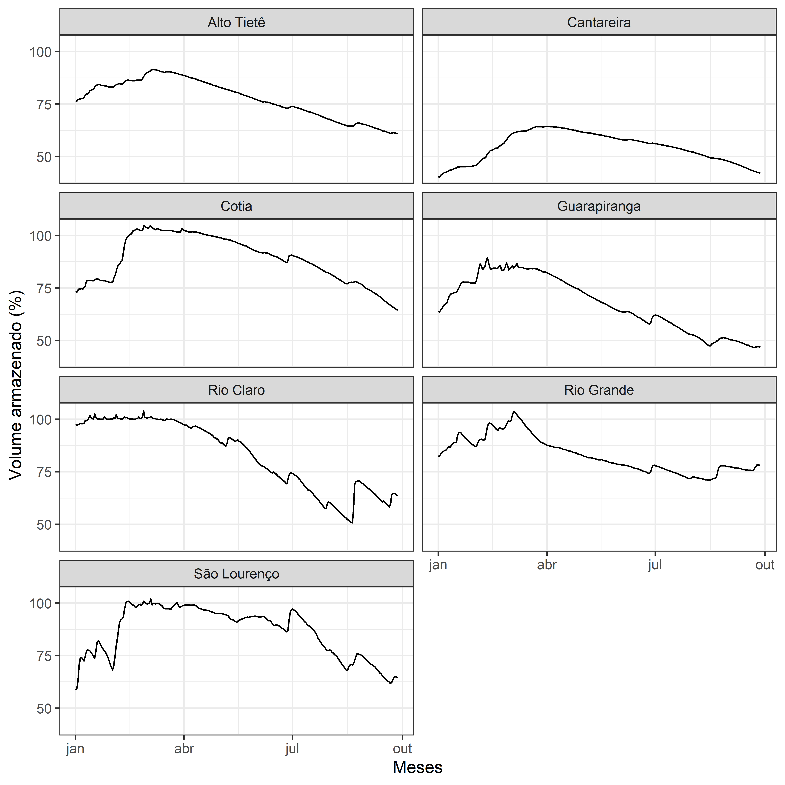

<!-- README.md is generated from README.Rmd. Please edit that file -->

# Mananciais

<!-- badges: start -->

[](https://github.com/beatrizmilz/mananciais/actions)
[](https://github.com/beatrizmilz/mananciais/actions)
[](https://www.tidyverse.org/lifecycle/#experimental)
<!-- badges: end -->

**PACOTE EM DESENVOLVIMENTO**

O objetivo deste pacote é disponibilizar a base de dados sobre volume
armazenado em mananciais de abastecimento público na Região
Metropolitana de São Paulo (SP - Brasil).

Os dados foram obtidos no [Portal dos
Mananciais](http://mananciais.sabesp.com.br/Situacao) da
[SABESP](http://site.sabesp.com.br/site/Default.aspx), através dos dados
disponíveis na
[API](http://mananciais.sabesp.com.br/api/Mananciais/ResumoSistemas/2020-01-01).

Existem dois arquivos disponíveis, em que a diferença é o período dos
dados. Caso você não utilize `R` e queira ter acesso aos dados em
formato `.csv`, os mesmos podem ser acessados através dos links a
seguir. Lembrete: o arquivo foi salvo em formato “separado por ponto e
vírgula”, e com encoding “UFT-8”.

  - `mananciais` - 2000 à 2019 - [Baixar versão
    `.csv`](https://github.com/beatrizmilz/mananciais/raw/master/data/mananciais.csv)

  - `mananciais_atualizado` - 2000 à 2020 (parcial) - [Baixar versão
    `.csv`](https://github.com/beatrizmilz/mananciais/raw/master/data/mananciais_atualizado.csv)

## Instalação

A versão em desenvolvimento deste pacote pode ser instalada através do
[GitHub](https://github.com/) utilizando:

``` r
# install.packages("devtools")
devtools::install_github("beatrizmilz/mananciais")
```

## Exemplos

Abaixo segue um exemplo das bases disponíveis:

``` r
library(mananciais)

str(mananciais)
#> Classes 'tbl_df', 'tbl' and 'data.frame':    44529 obs. of  8 variables:
#>  $ data              : Date, format: "2000-01-01" "2000-01-01" ...
#>  $ nome              : chr  "Cantareira" "Alto Tietê" "Guarapiranga" "Cotia" ...
#>  $ volume_porcentagem: num  47.1 50.9 36 18.8 81 73.2 47.8 51.4 36.4 18.8 ...
#>  $ volume_variacao   : num  0.3 0.1 0 0.9 0.4 -0.2 0.7 0.5 0.4 0 ...
#>  $ volume_operacional: num  365.51 196.03 64.8 2.65 91.69 ...
#>  $ prec_dia          : num  30.9 26 47.2 0 0 5.2 29.1 47.3 9.2 33.2 ...
#>  $ prec_mensal       : num  30.9 26 47.2 0 0 5.2 60 73.3 56.4 33.2 ...
#>  $ prec_hist         : num  255 238 225 218 235 ...

str(mananciais_atualizado)
#> Classes 'tbl_df', 'tbl' and 'data.frame':    46419 obs. of  8 variables:
#>  $ data              : Date, format: "2020-01-01" "2020-01-01" ...
#>  $ nome              : chr  "Cantareira" "Alto Tietê" "Guarapiranga" "Cotia" ...
#>  $ volume_porcentagem: num  40.3 76.6 64 73.4 82.6 97.6 58.8 40.4 76.4 63.6 ...
#>  $ volume_variacao   : num  -0.1 -0.2 -0.5 -0.4 -0.3 -0.5 -0.1 0.1 -0.2 -0.4 ...
#>  $ volume_operacional: num  396 429.2 109.6 12.1 92.7 ...
#>  $ prec_dia          : num  0.2 0 0.6 0 0 0 0 16.6 10.2 1.6 ...
#>  $ prec_mensal       : num  0.2 0 0.6 0 0 0 0 16.8 10.2 2.2 ...
#>  $ prec_hist         : num  263 246 229 225 251 ...
```

### Exemplo de tabela

``` r
library(dplyr)
library(knitr)

mananciais_atualizado %>% 
  arrange(desc(data)) %>% 
  head(7) %>%
  knitr::kable()
```

| data       | nome         | volume\_porcentagem | volume\_variacao | volume\_operacional | prec\_dia | prec\_mensal | prec\_hist |
| :--------- | :----------- | ------------------: | ---------------: | ------------------: | --------: | -----------: | ---------: |
| 2020-09-26 | Cantareira   |                42.3 |            \-0.2 |           415.11535 |       0.0 |         22.2 |       83.9 |
| 2020-09-26 | Alto Tietê   |                61.1 |            \-0.2 |           342.32382 |       0.1 |         19.0 |       80.0 |
| 2020-09-26 | Guarapiranga |                47.0 |              0.0 |            80.47698 |       0.0 |         11.0 |       77.8 |
| 2020-09-26 | Cotia        |                64.8 |            \-0.5 |            10.69014 |       0.0 |          6.6 |       82.5 |
| 2020-09-26 | Rio Grande   |                78.2 |              0.0 |            87.69203 |       0.2 |         25.4 |       95.0 |
| 2020-09-26 | Rio Claro    |                64.0 |            \-0.5 |             8.74863 |       0.2 |         89.8 |      141.6 |
| 2020-09-26 | São Lourenço |                64.9 |              0.0 |            57.63590 |       0.0 |         19.0 |      115.9 |

### Exemplos de gráficos

## Desde o início dos dados

``` r
library(ggplot2)
mananciais_atualizado %>%
  ggplot() +
  geom_line(aes(x = data, y = volume_porcentagem)) +
  scale_y_continuous(breaks = c(-25, 0, 25, 50, 75, 100)) +
facet_wrap( ~ nome, ncol = 2) +
  theme_bw() +
  labs(x = "Ano", y = "Volume armazenado (%)")
```



### Apenas ano atual

``` r
mananciais_atualizado %>%
  mutate(ano = lubridate::year(data)) %>% 
  filter(ano == 2020) %>% 
  ggplot() +
  geom_line(aes(x = data, y = volume_porcentagem)) +
  scale_y_continuous(breaks = c(-25, 0, 25, 50, 75, 100)) +
facet_wrap( ~ nome, ncol = 2) +
  theme_bw() +
  labs(x = "Meses", y = "Volume armazenado (%)")
```


